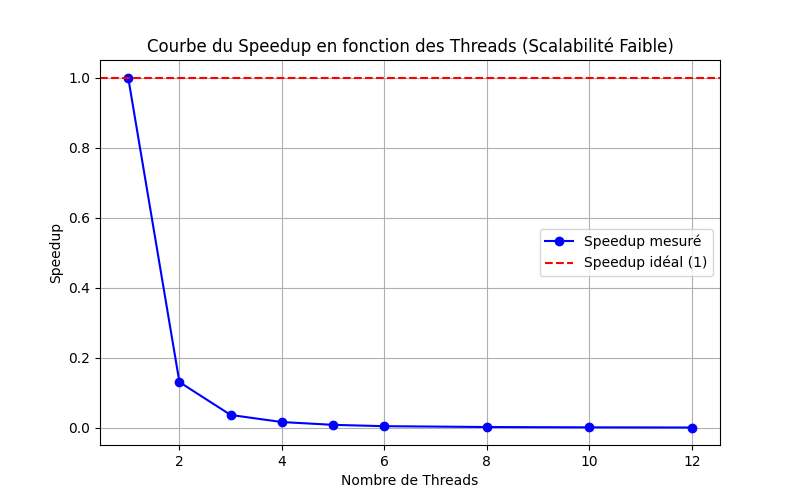
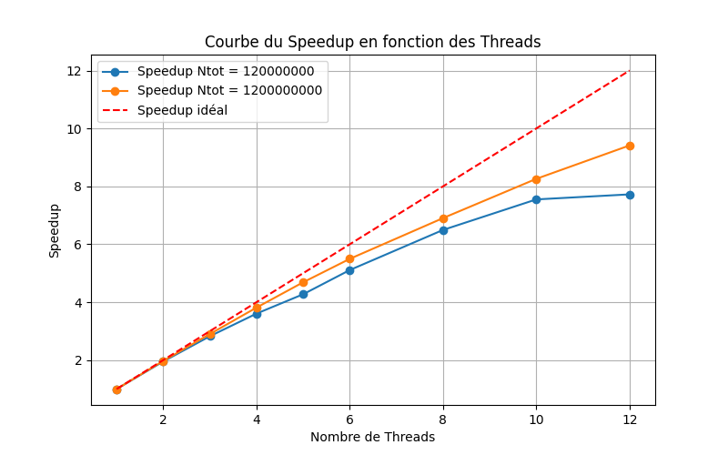
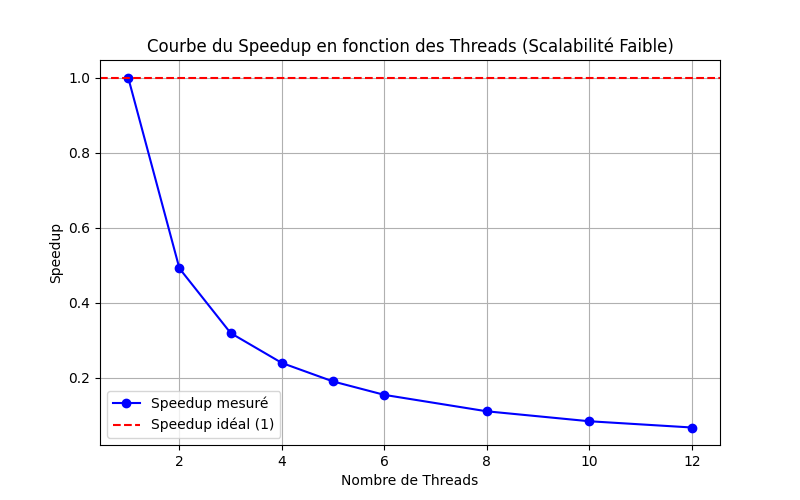

# Introduction 

# Calcule du speedup

## Définition

**Speedup :** Le speedup est 

**Scalabilité :** La scalabilité d'un système dépend de sa capacité à augmenter ses performances en fonction du nombre de processeurs. Deux types de scalabilité sont observables :

- **Scalabilité forte** : le nombre de tâches reste constant, on augmente le nombre de processeurs. Augmentation de la performance jusqu'à une certaine limite, où le système atteint ses capacités maximales.

- **Scalabilité faible** : la charge de travail augmente avec le nombre de processeurs. Gain de performance plus lent avec l'ajout de processeurs, souvent limité par les communications entre les unités de calcul.

## Scalabilité forte 

### Assignement102 
Données

Graphe

### Pi.java
Données

Graphe

## Scalabilité faible

### Assignement102 
Données

Graphe

### Pi.java
Données

Graphe
