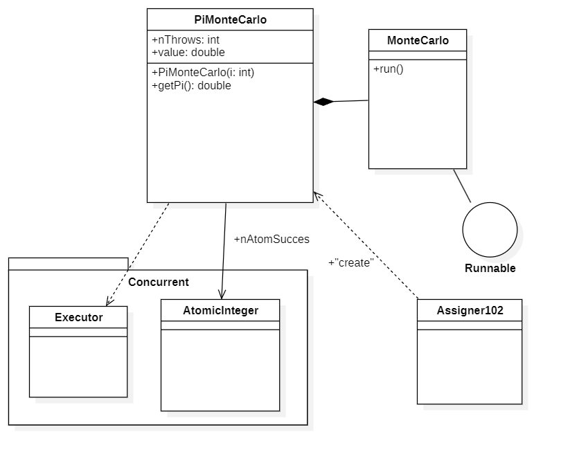
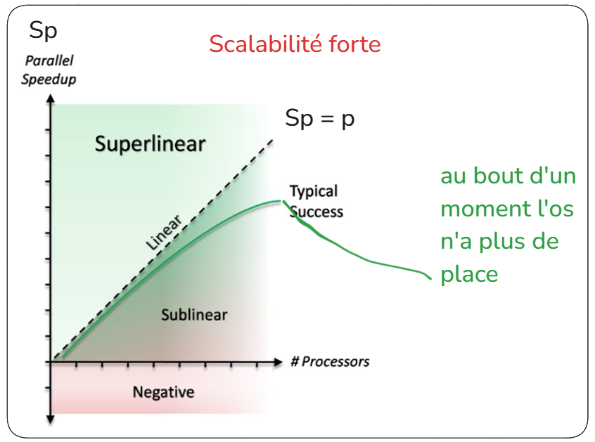
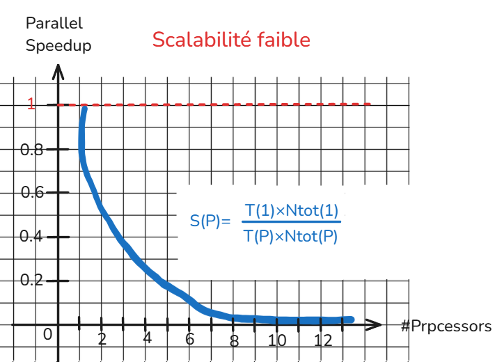
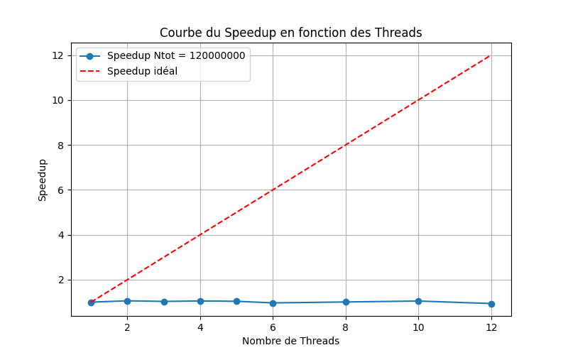

# Introduction 

# Calcule de Pi

# Methode monte carlo 
La méthode de Monte Carlo est une technique de calcul probabiliste utilisée pour estimer des quantités numériques complexes en s’appuyant sur des simulations aléatoires. Elle repose sur le principe que, en générant un grand nombre d’échantillons aléatoires et en analysant leur comportement, on peut obtenir une approximation fiable d’une valeur mathématique ou physique difficile à calculer analytiquement.

Dans nos traveaux nous avons utiliser cette méthode pour l’estimation de π en générant aléatoirement des points dans un graphe avec un quart de cercle déssiner sur celui-ci, le but etant de calculer la proportion des point qui tombent dans le cercle, Les point sont donc gnérer aléatoirement sur une zonne carré du graphe, 75% d'entre eux sont generer dans le cerlce et 25% en dehors.

# L'architecture du projet 

## Pi.java 

### Objectif du programme : 
Le programme estime la valeur de π en générant aléatoirement des points dans un carré unité [0,1]×[0,1] et en comptant combien tombent à l’intérieur d’un quart de cercle inscrit dans ce carré. 

### Décomposition du progamme : 

- Classe Pi :
- Classe Master : 
- classe Worker : 

## Assignement 102 :

### Objectif du programme : 

### Décomposition du progamme : 

- Classe PiMonteCarlo :
- Classe Assignement102 : 

### Shémat UML : 

## Master 

### Objectif du programme : 

### Décomposition du progamme : 

- Classe Master :

### Shémat UML : 

## Worker 

### Objectif du programme : 

### Décomposition du progamme : 

- Classe Worker :

### Shémat UML : 

# Calcule du speedup

## Définition

**Speedup :** Le speedup est 

**Scalabilité :** La scalabilité d'un système dépend de sa capacité à augmenter ses performances en fonction du nombre de processeurs. Deux types de scalabilité sont observables :

- **Scalabilité forte** : le nombre de tâches reste constant, on augmente le nombre de processeurs. Augmentation de la performance jusqu'à une certaine limite, où le système atteint ses capacités maximales.

- **Scalabilité faible** : la charge de travail augmente proprtionelelment avec le nombre de processeurs. 

## Scalabilité forte 

### En mémoire Partager 

#### Assignement102 
- Données :

Pour chaque lancer de teste avec un nombre de procésseur j'ai fais un totale de 5 lancer pour obtenir un résultat plus juste. mais pour que se soit plus lisible j'ai fais la moyenne de la colonne "error" et celle de la "duration" pour chaque test aillant le même nombre de processeur "Threads" et de nombre totale "Ntot". 

| Error        | Ntot      | Threads | Duration |
|--------------|-----------|---------|----------|
| 4.563299E-05 | 120000000 | 1       | 6326.80  |
| 5.899260E-05 | 120000000 | 2       | 5969.60  |
| 5.094997E-05 | 120000000 | 3       | 6128.00  |
| 4.525010E-05 | 120000000 | 4       | 6005.80  |
| 3.179999E-05 | 120000000 | 5       | 6092.80  |
| 6.394504E-05 | 120000000 | 6       | 6538.20  |
| 4.519963E-05 | 120000000 | 8       | 6278.00  |
| 3.430024E-05 | 120000000 | 10      | 6027.20  |
| 2.471229E-05 | 120000000 | 12      | 6741.00  |

- Graphe :

- Interprétation :

#### Pi.java
- Données : 

| Error                  | Ntot       | Threads | Duration |
|------------------------|------------|---------|----------|
| 3.893391864507592e-05  | 120000000  | 1       | 1739.2   |
| 3.44122532619994e-05   | 120000000  | 2       | 891.0    |
| 2.9180152866478063e-05 | 120000000  | 3       | 615.8    |
| 5.100256452991623e-05  | 120000000  | 4       | 482.4    |
| 4.4450082072974674e-05 | 120000000  | 5       | 407.0    |
| 2.378964839378548e-05  | 120000000  | 6       | 340.4    |
| 2.2268584204429588e-05 | 120000000  | 8       | 267.8    |
| 2.25491539709505e-05   | 120000000  | 10      | 230.4    |
| 6.048137587382007e-05  | 120000000  | 12      | 225.2    |
| 1.0725214938760653e-05 | 1200000000 | 1       | 16987.8  |
| 2.2059952472201364e-05 | 1200000000 | 2       | 8621.4   |
| 9.168646941898716e-06  | 1200000000 | 3       | 5856.4   |
| 2.0741725130248365e-05 | 1200000000 | 4       | 4455.2   |
| 9.25452530418952e-06   | 1200000000 | 5       | 3624.6   |
| 1.177939197487478e-05  | 1200000000 | 6       | 3090.8   |
| 1.223291011286499e-05  | 1200000000 | 8       | 2460.8   |
| 1.1667526447995493e-05 | 1200000000 | 10      | 2056.8   |
| 1.168305018265772e-05  | 1200000000 | 12      | 1804.8   |

- Graphe :

- Interprétation :

#### Master/Worker.java
- Données :

| Error        | Ntot      | Threads | Duration |
|--------------|-----------|---------|----------|
|  | 120000000 | 1       |   |
|  | 120000000 | 2       |   |
|  | 120000000 | 3       |   |
|  | 120000000 | 4       |   |
|  | 120000000 | 5       |   |
|  | 120000000 | 6       |   |
|  | 120000000 | 8       |   |
|  | 120000000 | 10      |   |
|  | 120000000 | 12      |   |

- Graphe :

- Interprétation :

### En mémoire distribuer

#### Master/Worker.java
- Données :

| Error        | Ntot      | Threads | Duration |
|--------------|-----------|---------|----------|
|  | 120000000 | 1       |   |
|  | 120000000 | 2       |   |
|  | 120000000 | 3       |   |
|  | 120000000 | 4       |   |
|  | 120000000 | 5       |   |
|  | 120000000 | 6       |   |
|  | 120000000 | 8       |   |
|  | 120000000 | 10      |   |
|  | 120000000 | 12      |   |

- Graphe :

- Interprétation :

## Scalabilité faible

### En mémoire Partager

#### Assignement102 
- Données :

| Error        | Ntot      | Threads | Duration |
|--------------|-----------|---------|----------|
| 0.00011811502093290698 | 120000000 | 1       | 602.0 |
| 8.269774093013097e-05 | 120000000 | 2       | 1157.8  |
| 3.752436630491873e-05 | 120000000 | 3       | 1844.8  |
| 4.8147177951170264e-05 | 120000000 | 4       | 2343.4  |
| 9.574253713262492e-05 | 120000000 | 5       | 2996.0  |
| 5.96308845113726e-05 | 120000000 | 6       | 4013.0  |
| 3.909989685256029e-05 | 120000000 | 8       | 5136.8  |
| 5.5979266150540314e-05 | 120000000 | 10      | 6368.4  |
| 2.9817626893769117e-05 | 120000000 | 12      | 8835.4  |

- Graphe :

- Interprétation :

#### Pi.java
- Données :

| Error        | Ntot      | Threads | Duration |
|--------------|-----------|---------|----------|
| 1.332925369518373e-05 | 120000000 | 1       | 4291.0  |
| 1.9190217438009317e-05 | 120000000 | 2       | 1770.8 |
| 1.2098273173821361e-05 | 120000000 | 3       | 1818.4  |
| 1.8921629201056837e-05 | 120000000 | 4       | 1817.8  |
| 9.682545997773335e-06 | 120000000 | 5       | 1831.6  |
| 1.640425506797887e-05 | 120000000 | 6       | 1879.4  |
| 1.1455744270449875e-05 | 120000000 | 8       | 1968.2  |
| 2.169340638298398e-05 | 120000000 | 10      | 2070.8  |
| 1.4967513059373683e-05 | 120000000 | 12      | 2152.0  |

- Graphe :

- Interprétation :

#### Master/Worker.java
- Données : 

| Error        | Ntot      | Threads | Duration |
|--------------|-----------|---------|----------|
|  | 120000000 | 1       |   |
|  | 120000000 | 2       |   |
|  | 120000000 | 3       |   |
|  | 120000000 | 4       |   |
|  | 120000000 | 5       |   |
|  | 120000000 | 6       |   |
|  | 120000000 | 8       |   |
|  | 120000000 | 10      |   |
|  | 120000000 | 12      |   |

- Graphe :

- Interprétation :

### En mémoire distribuer

#### Master/Worker.java
- Données :

| Error        | Ntot      | Threads | Duration |
|--------------|-----------|---------|----------|
|  | 120000000 | 1       |   |
|  | 120000000 | 2       |   |
|  | 120000000 | 3       |   |
|  | 120000000 | 4       |   |
|  | 120000000 | 5       |   |
|  | 120000000 | 6       |   |
|  | 120000000 | 8       |   |
|  | 120000000 | 10      |   |
|  | 120000000 | 12      |   |

- Graphe :

- Interprétation :